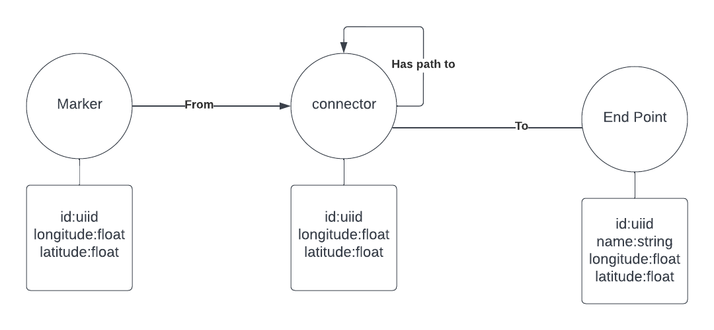

## Data Model


## Installation

```bash
$ npm install
```

## Running the app

```bash
# development
$ npm run start

# watch mode
$ npm run start:dev

# production mode
$ npm run start:prod
```
## Configuration
```ts
Neo4jModule.forRoot(
    {
      scheme:"the data base shceme need to be on of 'neo4j' | 'neo4j+s' | 'neo4j+scc' | 'bolt' | 'bolt+s' | 'bolt+scc';",
      host:'the host of the data base example localhost',
      port:"the port to connect the databasecan be string or a int ",
      username:'username',
      password:'password'
    }
  )
 ```
## api
we have 3 type of node in the data base:
* markers:the marker represent where the qr code will be placed in the building 
* connectors:connector represent the nodes that will form a path to the end point
* end points: represent stratigic places that the user want to visit in the building (conference room,lab..)

marker api endpoints:
sending request ***HTTP GET*** to `/marker` will result in giving list of marker avilable 
```
{
    "markers": [
        {
            "id": string,
            "Longitude": number,
            "longitude": number
        }
        ...
    ]
}
```
sending request ***HTTP POST*** to `/marker` will result in creating new marker 
body:
```
{"marker":{
    "longitude": 10.2367232,
    "latitude": 36.7951872}
}
```
response:
```
{
    "marker": {
        "id": "9bd2b373-9fbb-487e-93d0-b5c8f8be1f44",
        "latitude": 36.7951872,
        "longitude": 10.2367232
    }
}
```

## Test

```bash
# unit tests
$ npm run test

# e2e tests
$ npm run test:e2e

# test coverage
$ npm run test:cov
```

